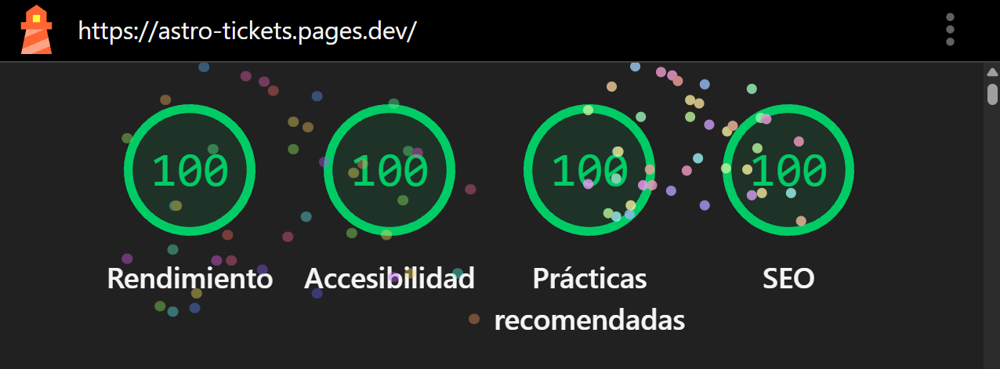
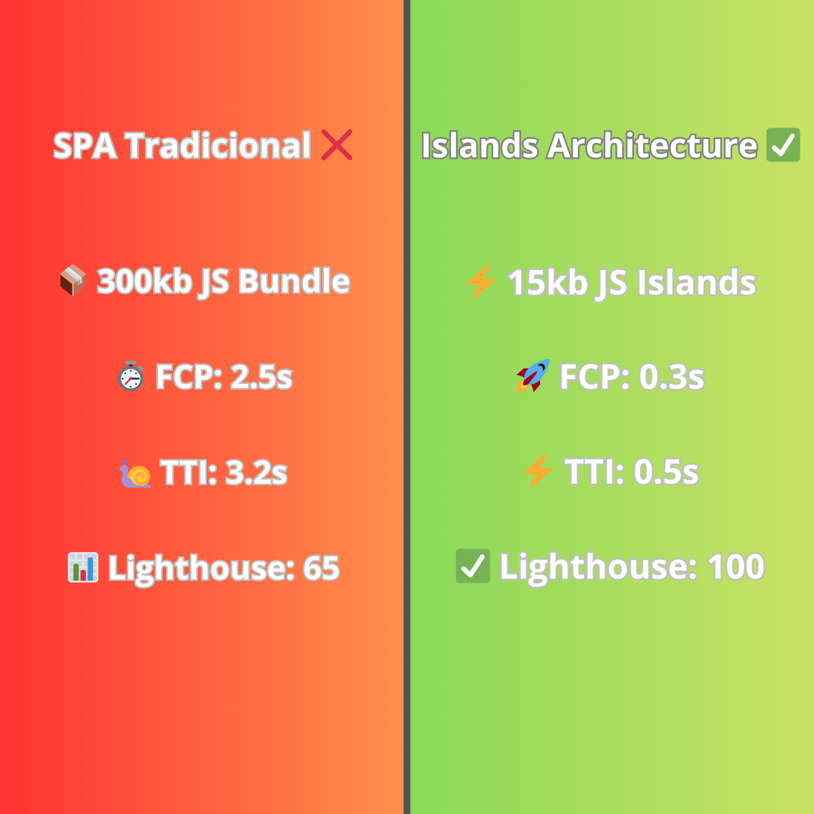
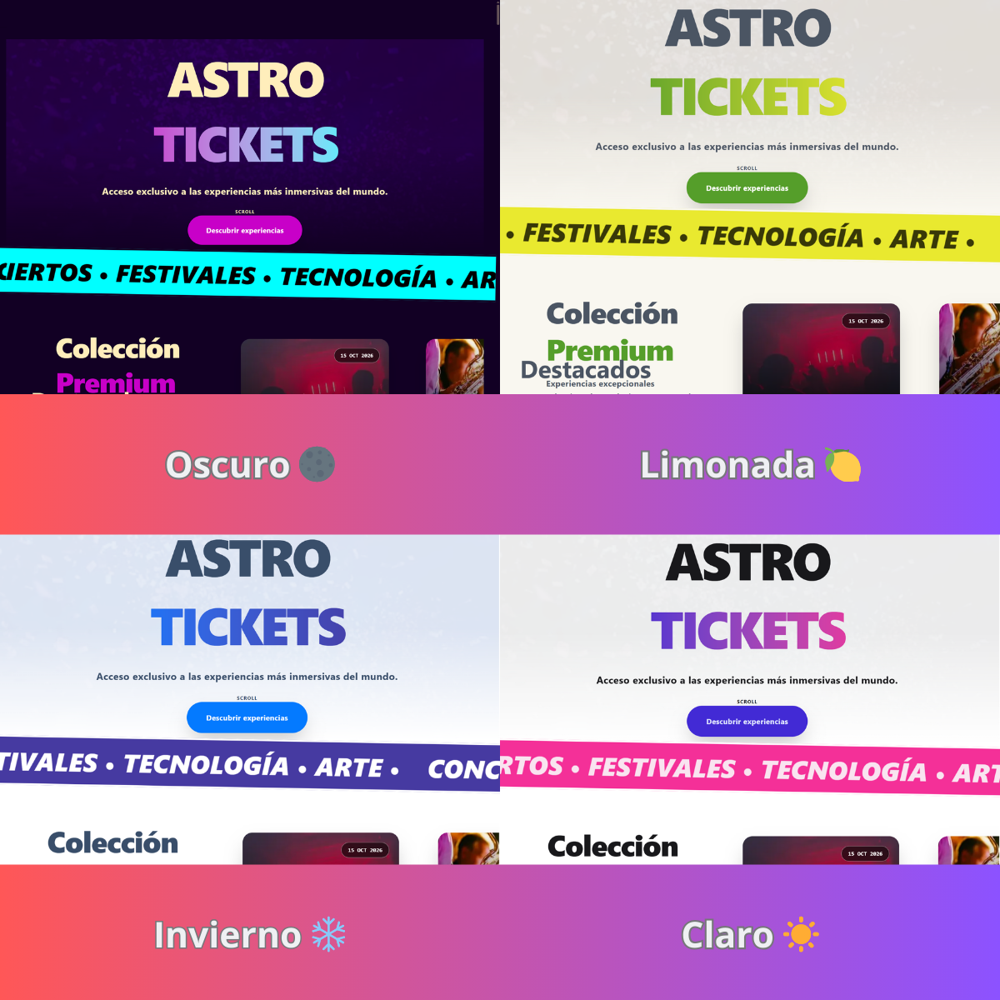
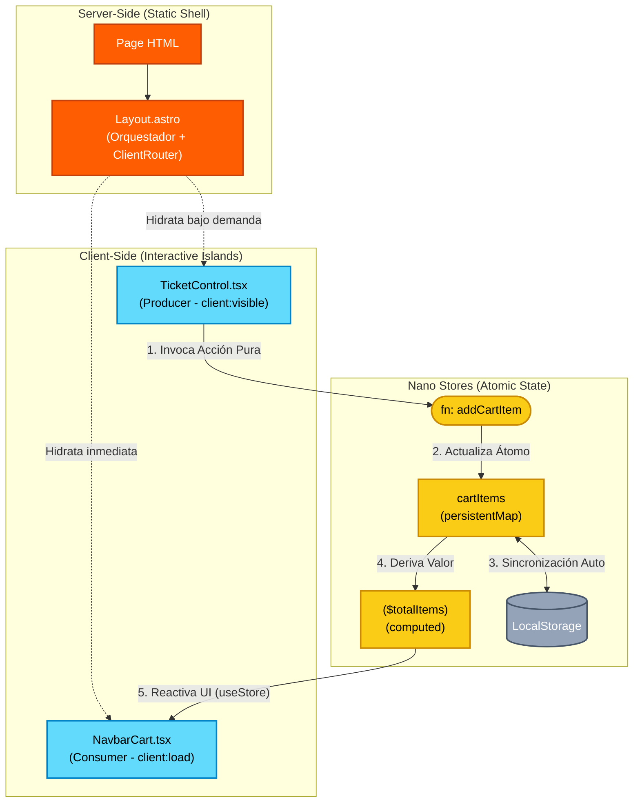

# ✨ AstroTickets

> **Sistema de gestión de eventos con Arquitectura de Islas**  
> 0kb JavaScript inicial · 100/100 Lighthouse · Edge-first deployment

[](https://astro-tickets.pages.dev)
[](https://astro.build)
[](https://tailwindcss.com)
[](https://astro-tickets.pages.dev)

🌐 **Demo en vivo (Edge):** [https://astro-tickets.pages.dev](https://astro-tickets.pages.dev)

---

## 🎬 Preview

<div align="center">
  
  <p><em>Puntuación perfecta en todas las métricas de Lighthouse (Desktop)</em></p>
</div>

<div align="center">
  
  <p><em>SPA Tradicional vs Islands Architecture: La diferencia es clara</em></p>
</div>

<div align="center">
  
  <p><em>Sistema multi-tema: Oscuro, Claro, Invierno y Limonada</em></p>
</div>

<div align="center">
  
  <p><em>Rendimiento excepcional también en mobile</em></p>
</div>

---

## 🎯 ¿Por Qué Arquitectura de Islas?

| Enfoque Tradicional SPA         | AstroTickets (Islands Architecture)            |
| ------------------------------- | ---------------------------------------------- |
| 💾 200kb+ JavaScript bundle     | ⚡ ~15kb (solo islas activas)                  |
| 🔄 Hidratación completa en load | 🎯 Hidratación bajo demanda (`client:visible`) |
| ⚛️ React en toda la aplicación  | 🏝️ React solo donde se necesita interactividad |
| ⏱️ TTI: ~3 segundos             | 🚀 TTI: ~0.5 segundos                          |
| 📱 First Contentful Paint: 2s+  | ⚡ FCP: 0.6s (Edge optimizado)                 |

**Resultado:** Rendimiento de sitio estático con la interactividad de una SPA.

---

## ⚡ Performance Metrics

```bash
Lighthouse Score (Desktop) - Medido en Cloudflare Edge:
━━━━━━━━━━━━━━━━━━━━━━━━━━━━━━━━━━━━━━━━━━━━━━━━━
Performance:       100 🟢  FCP: 0.6s | LCP: 0.8s | TBT: 0ms
Accessibility:     100 🟢  WCAG 2.1 AAA compliant
Best Practices:    100 🟢  HTTPS + Security headers
SEO:               100 🟢  Semantic HTML + Meta optimizado
━━━━━━━━━━━━━━━━━━━━━━━━━━━━━━━━━━━━━━━━━━━━━━━━━

Bundle Size Comparison:
━━━━━━━━━━━━━━━━━━━━━━━━━━━━━━━━━━━━━━━━━━━━━━━━━
HTML Estático:              ~12kb  (comprimido gzip)
JavaScript Islands:         ~15kb  (hidratación parcial)
CSS (Tailwind):             ~8kb   (purged + minified)
━━━━━━━━━━━━━━━━━━━━━━━━━━━━━━━━━━━━━━━━━━━━━━━━━
TOTAL INICIAL:              ~35kb  vs ~300kb en SPA tradicional
```

---

## 🏗️ Arquitectura de Software

Este proyecto implementa la **Arquitectura de Islas (Islands Architecture)** de Astro combinada con un patrón de **Estado Atómico Desacoplado** (Nano Stores). El objetivo es mantener el hilo principal libre bloqueando la hidratación de componentes hasta que sea estrictamente necesaria.

### Diagrama de Flujo de Datos



### Principios de Diseño

1. **Static-First, Interactive When Needed:** El HTML se genera en build time, el JavaScript solo se carga donde hay interacción real.
2. **Zero-Bundle-Cost Components:** Los componentes `.astro` generan 0kb de JavaScript en el cliente.
3. **Atomic State Management:** Nano Stores permite compartir estado entre islas sin coordinación central pesada.
4. **Edge-Native:** Desplegado en 300+ ubicaciones de Cloudflare para latencia <50ms global.

---

## 🛠️ Stack Tecnológico "Bleeding Edge"

### Core & Performance

- **Astro 5.16:** Framework MPA de nueva generación con Islands Architecture nativa.
- **Cloudflare Pages:** Despliegue en el Edge global (300+ ubicaciones) para latencia mínima.
- **View Transitions API:** Navegación SPA-like sin JavaScript adicional.

### UI & Styling

- **Tailwind CSS 4:** Nuevo motor de compilación JIT (Rust-based) para estilos instantáneos.
- **DaisyUI 5:** Componentes semánticos y accesibles basados en Tailwind.
- **React 19:** Biblioteca de UI para las islas de interactividad compleja.

### Estado & UX

- **Nano Stores:** Gestión de estado agnóstica y ultraligera (< 1kb) con persistencia nativa.
- **GSAP + ScrollTrigger:** Animaciones de alto rendimiento ligadas al scroll (GPU-accelerated).
- **React-Leaflet:** Mapas interactivos dinámicos con lazy loading.

### Data & Analytics

- **Recharts:** Visualización de datos responsiva en el dashboard admin.
- **SweetAlert2:** Modales y notificaciones con UX pulida.
- **Canvas Confetti:** Efectos visuales celebratorios post-compra.

---

## ✨ Funcionalidades Principales

### 🛒 Sistema de Carrito Inteligente

- **Estado Reactivo Desacoplado:** Sincronización automática entre Navbar y controles de tickets.
- **Persistencia Local:** El carrito sobrevive a recargas y navegación.
- **Optimistic Updates:** UI instantánea sin esperas de red.

### 🎨 Sistema Multi-Tema (4 Temas)

- **Claro (☀️):** Paleta luminosa para entornos diurnos.
- **Invierno (❄️):** Tonos fríos azulados de alta elegancia.
- **Limonada (🍋):** Paleta vibrante y energética.
- **Oscuro (🌑):** Tema dark mode con contraste optimizado.

**Características:**

- Persistencia de preferencia en `localStorage`
- Transiciones suaves entre temas (250ms fade)
- WCAG 2.1 AAA compliant (contraste 7:1)

### 🗺️ Geolocalización Interactiva

- Mapa Leaflet con marcadores de sedes y eventos.
- Lazy loading (solo carga cuando el mapa es visible).
- Zoom y navegación táctil optimizada para mobile.

### 📊 Dashboard Admin

- Gráficos de ventas en tiempo real con Recharts.
- Estadísticas de eventos más populares.
- Exportación de datos en formato CSV.

### 📧 Sistema de Contacto Dual

- **Formspree Integration:** Formulario con validación y envío a email.
- **WhatsApp Directo:** Botón de contacto con mensaje pre-rellenado.
- Validación en cliente y servidor.

### 🎭 Efectos Visuales Avanzados

- **Animated Borders:** Gradientes dinámicos en componentes destacados.
- **Smooth Scrolling:** Lenis para scroll fluido (60fps).
- **Confetti Effects:** Celebración visual al completar compra.

---

## 🚀 Instalación y Desarrollo

### Prerequisitos

```bash
Node.js >= 18.x
npm >= 9.x
```

### Instalación Local

```bash
# 1. Clonar repositorio
git clone https://github.com/albertoguinda/astro-tickets.git
cd astro-tickets

# 2. Instalar dependencias
npm install

# 3. Iniciar servidor de desarrollo
npm run dev
# La app estará disponible en http://localhost:4321
```

### Comandos Disponibles

```bash
npm run dev          # Servidor de desarrollo (Hot Reload)
npm run build        # Build de producción optimizado
npm run preview      # Preview del build local
npm run astro        # CLI de Astro (check, sync, etc.)
```

---

## 📁 Estructura del Proyecto

```bash
astro-tickets/
├── src/
│   ├── components/
│   │   ├── islands/          # Componentes React Interactivos (hidratados)
│   │   │   ├── TicketControl.tsx
│   │   │   ├── NavbarCart.tsx
│   │   │   ├── CartList.tsx
│   │   │   ├── ContactForm.tsx
│   │   │   ├── InteractiveMap.tsx
│   │   │   └── DashboardCharts.tsx
│   │   ├── layout/           # Layout components
│   │   │   ├── Navbar.astro
│   │   │   └── Footer.astro
│   │   └── ui/               # Componentes Astro Estáticos (0 JS)
│   │       ├── EventCard.astro
│   │       └── CommunityCard.astro
│   ├── pages/                # Rutas basadas en archivos
│   │   ├── index.astro       # Homepage
│   │   ├── events.astro      # Catálogo de eventos
│   │   ├── admin/
│   │   │   └── dashboard.astro
│   │   ├── about.astro
│   │   ├── contact.astro
│   │   ├── community.astro
│   │   ├── location.astro
│   │   └── merch.astro
│   ├── store/                # Nano Stores (Estado global)
│   │   └── cart.ts           # Estado del carrito
│   ├── layouts/              # Plantillas maestras
│   │   └── Layout.astro      # Layout principal + View Transitions
│   ├── assets/
│   │   └── images/           # Imágenes del proyecto
│   ├── scripts/
│   │   └── smooth-scroll.js  # Scripts globales
│   └── styles/
│       └── global.css        # Estilos globales + Tailwind
├── public/                   # Assets estáticos (no procesados)
│   ├── favicon.svg
│   ├── robots.txt
│   ├── sitemap.xml
│   └── leaflet/              # Assets para mapas
├── docs/
│   └── screenshots/          # Capturas para README
│       ├── lighthouse-desktop.png
│       ├── lighthouse-mobile.png
│       ├── comparativa.png
│       ├── diagrama.png
│       └── temas.png
├── astro.config.mjs          # Configuración de Astro + adapters
├── package.json
├── tsconfig.json
├── wrangler.jsonc            # Configuración Cloudflare Workers
└── LICENSE
```

---

## 🛣️ Roadmap

### v2.0 (Q1 2026)

- [ ] **Integración Stripe:** Pagos reales con checkout embebido.
- [ ] **PWA con Offline-First:** Service Worker para cache de eventos.
- [ ] **Analytics Dashboard:** Panel de métricas en tiempo real con WebSockets.
- [ ] **i18n Support:** Internacionalización (ES/EN/FR).

### v2.1 (Q2 2026)

- [ ] **Autenticación OAuth:** Login con Google/GitHub.
- [ ] **Sistema de Reviews:** Valoraciones de eventos con moderación.
- [ ] **Notificaciones Push:** Alertas de eventos favoritos.
- [ ] **Exportación PDF:** Generación de tickets en PDF.

### Backlog

- [ ] **Modo Kiosko:** Interfaz optimizada para pantallas táctiles (eventos presenciales).
- [ ] **Integración Calendar:** Sincronización con Google Calendar/iCal.
- [ ] **A/B Testing Framework:** Experimentación de UX integrada.

---

## 🤝 Contribuciones

Las contribuciones son bienvenidas. Por favor:

1. Fork el proyecto
2. Crea una rama feature (`git checkout -b feature/AmazingFeature`)
3. Commit tus cambios (`git commit -m 'Add: Amazing Feature'`)
4. Push a la rama (`git push origin feature/AmazingFeature`)
5. Abre un Pull Request

### Guías de Estilo

- **Commits:** Conventional Commits (`feat:`, `fix:`, `docs:`, etc.)
- **TypeScript:** Strict mode habilitado
- **Linting:** ESLint + Prettier preconfigurado
- **Naming:** camelCase para funciones, PascalCase para componentes

---

## 📄 Licencia

Este proyecto está bajo la Licencia MIT. Ver archivo [`LICENSE`](LICENSE) para más detalles.

---

## 🤝 ¿Te Gusta el Proyecto?

- ⭐ **Dale una estrella** si te resultó útil o inspirador
- 🐛 **Reporta bugs** en [Issues](https://github.com/albertoguinda/astro-tickets/issues)
- 💡 **¿Necesitas un proyecto similar?** [Contáctame directamente](https://astro-tickets.pages.dev/contacto)
- 🔗 **Comparte** en LinkedIn/Twitter con #AstroIslands

---

<div align="center">
  <p><strong>Desarrollado por <a href="https://www.linkedin.com/in/albertoguindasevilla/">Alberto Guinda Sevilla</a></strong></p>
  
  <p>
    <a href="https://www.linkedin.com/in/albertoguindasevilla/" target="_blank">
      
    </a>
    <a href="https://github.com/albertoguinda" target="_blank">
      
    </a>
    <a href="https://albertoguindaportfolio.vercel.app/" target="_blank">
      
    </a>
  </p>
  
  <p><sub>Full-Stack Developer especializado en Web + IoT + IA | Zaragoza, España</sub></p>
</div>
